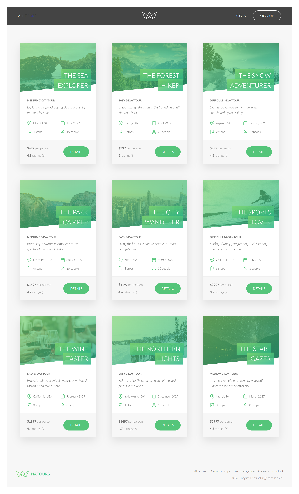
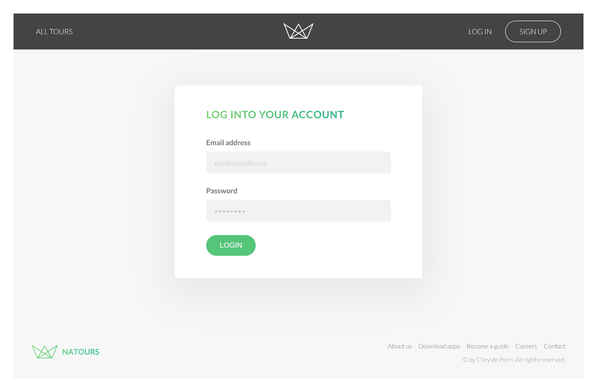
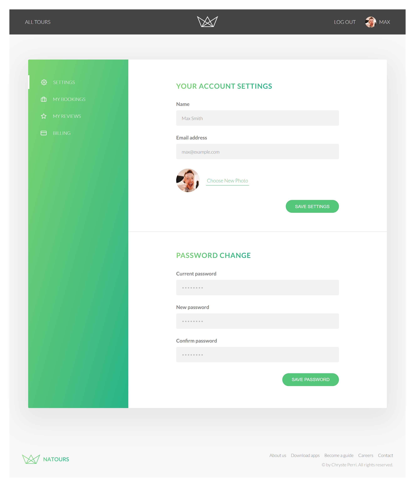
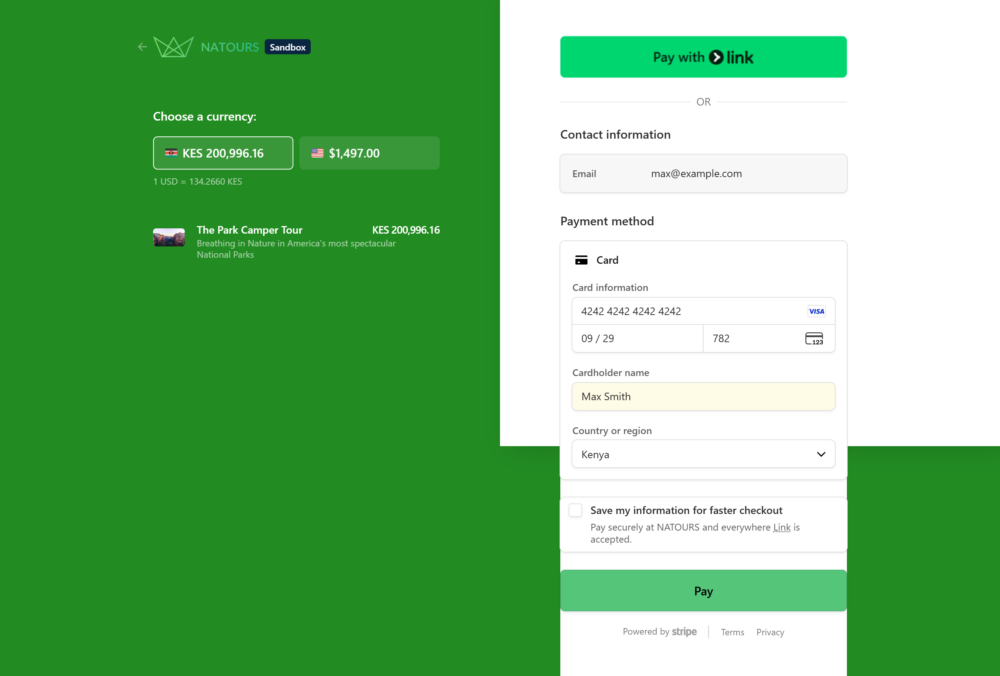
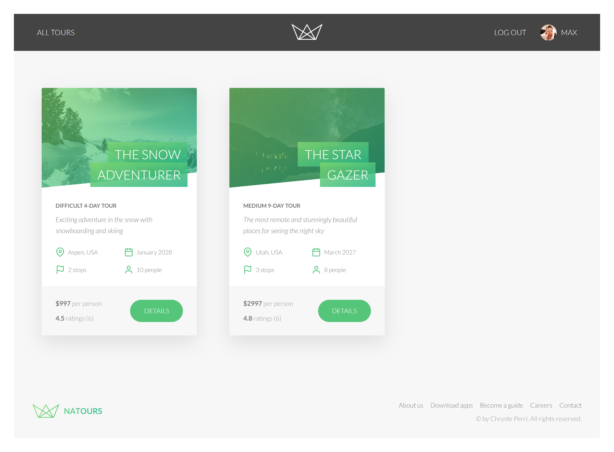

# 🌍 Natours — Tour Booking Platform


A full-stack tour booking platform built with **Node.js, Express, MongoDB, and Pug**, featuring authentication, Stripe payments, geospatial queries, reviews, and email notifications.

---

## 📌 Live Demo

- 🌐 Live App: `<https://natours-api-sl6i.onrender.com/>`
- 📘 API Documentation: `<https://documenter.getpostman.com/view/49180681/2sBXihrYjH>`

---

## 📑 Table of Contents

- Features
- Tech Stack
- Screenshots
- Project Structure
- Installation & Setup
- Scripts
- Authentication Flow
- Payments (Stripe)
- Geospatial Features
- Email System
- API Documentation
- Deployment
- License

---

## 🚀 Features

### 👤 Authentication & Authorization
- JWT-based authentication
- Signup, login, logout
- Password reset via email
- Role-based access control (user, admin, lead-guide)

### 🏞 Tours
- Create, update, delete tours
- Advanced filtering, sorting, pagination
- Aggregation-based tour statistics
- Top 5 cheap tours endpoint

### 🌍 Geospatial Features
- Find tours within a radius
- Calculate distances from a point

### ⭐ Reviews
- Create, update, delete reviews
- Nested routes for tour reviews
- Ownership-based access control

### 💳 Bookings
- Stripe Checkout integration
- Webhook-based booking creation
- “My Bookings” page

### 📧 Email System
- Welcome emails on signup
- Password reset emails
- HTML email templates using Pug

### 🖥 Frontend (SSR)
- Server-side rendered pages using Pug
- Dynamic tour pages
- User account dashboard

---

## 🧱 Tech Stack

- Node.js
- Express.js
- MongoDB + Mongoose
- Pug templates
- JWT Authentication
- Stripe Payments
- Nodemailer / SendGrid
- Multer + Sharp (file uploads)
- Helmet, rate limiting, sanitization

---

## 📸 Screenshots

### Home Page


### Tour Page


### Login Page


### Account Page


### Stripe Checkout


### My Bookings


---

````md

## 📁 Project Structure

```bash
├── controllers
├── models
├── routes
├── views
├── public
├── utils
├── app.js
├── server.js
└── config.env
````

---

## ⚙️ Installation & Setup

### 1. Clone Repository

```bash
git clone https://github.com/chrysteperri/Natours-API.git
cd natours
```

### 2. Install Dependencies

```bash
npm install
```

### 3. Environment Setup

Create a `config.env` file in the project root:

```env
NODE_ENV=development
PORT=3000

DATABASE=<your-mongodb-uri>
DATABASE_PASSWORD=<your-db-password>

JWT_SECRET=<your-secret>
JWT_EXPIRES_IN=90d
JWT_COOKIE_EXPIRES_IN=90

EMAIL_USERNAME=<your-username>
EMAIL_PASSWORD=<your-email-password>
EMAIL_HOST=<smtp-host>
EMAIL_PORT=<smtp-port>

EMAIL_FROM=<your-email>

SENDGRID_USERNAME=<sendgrid-username>
SENDGRID_PASSWORD=<sendgrid-password>

STRIPE_SECRET_KEY=<your-stripe-key>
STRIPE_WEBHOOK_SECRET=<your-webhook-secret>
```

---

## ▶️ Scripts

```bash
npm run start:dev
npm run start
npm run build:js
```

| Script                | Description                                         |
| --------------------- | --------------------------------------------------- |
| `npm run start:dev`   | Start application in development mode using Nodemon |
| `npm run start`       | Start application in production mode                |
| `npm run build:js`    | Build frontend assets using Parcel                  |

---

## 🔐 Authentication Flow

* User signs up or logs in
* JWT is stored in HTTP-only cookies
* Protected routes validate the token
* Role-based authorization is enforced

---

## 💳 Payments (Stripe)

* User clicks **Book Tour**
* Stripe Checkout Session is created
* User is redirected to Stripe Checkout
* Stripe sends a webhook event after successful payment
* Booking is created and stored in the database

---

## 🌍 Geospatial Features

Available endpoints:

```text
/tours-within/:distance/center/:latlng/unit/:unit
/distances/:latlng/unit/:unit
```

Examples:

```http
GET /api/v1/tours/tours-within/100/center/34.111745,-118.113491/unit/mi
```

```http
GET /api/v1/tours/distances/34.111745,-118.113491/unit/mi
```

---

## 📧 Email System

* Welcome email sent upon account creation
* Password reset email with secure reset token
* Email templates rendered using Pug
* Uses Nodemailer in development and SendGrid in production

---

## 📘 API Documentation

The API is fully documented using Postman.

**Documentation URL:**

https://documenter.getpostman.com/view/49180681/2sBXihrYjH

Included collections:

* Authentication
* Tours
* Reviews
* Bookings
* Users
* Tours/Reviews

---

## 🚀 Deployment

The application is deployed on Render.

**Live URL:**

https://natours-api-sl6i.onrender.com/

---

## 📄 License

This project is licensed under the MIT License. See the [LICENSE](LICENSE) file for details.